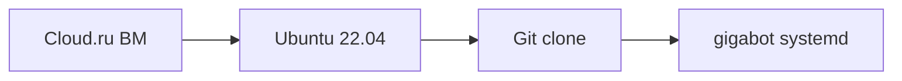

# Деплой для презентации: как это устроено

**Для презентации CSM в Сбере.** Краткое описание цепочки деплоя GigaBotPresent: от облака до работающего бота. Подробная пошаговая инструкция — в [DEPLOY-UBUNTU.md](DEPLOY-UBUNTU.md).

---

## Цепочка деплоя

Развёртывание строится по простой схеме:

1. **Cloud.ru (или SberCloud)** — создаётся виртуальная машина с доступом по SSH.
2. **На ВМ ставится Linux** — Ubuntu 22.04; на неё ставятся системные пакеты (Python 3.11, git, OCR и т.д.).
3. **Подключение к GitHub** — с сервера выполняется `git clone` репозитория GigaBotPresent; код не правится вручную, всё берётся из репозитория.
4. **Установка приложения** — в каталоге проекта создаётся виртуальное окружение Python, ставится пакет `gigabot`, настраивается systemd-сервис. Бот запускается как служба и работает постоянно.

Итог: **инфраструктура (Cloud.ru) → ОС (Ubuntu) → код из GitHub → работающее приложение**. Ручной правки кода или сложной настройки инфраструктуры не требуется — достаточно выполнить последовательность команд по инструкции.

---

## Что нужно от пользователя: только ключи

От того, кто разворачивает бота, требуются только **учётные данные и ключи**:

| Что | Зачем |
|-----|--------|
| **API GigaChat** | Доступ к LLM (чат и при необходимости эмбеддинги для RAG). |
| **Токен Telegram-бота** | Чтобы бот работал в Telegram; создаётся через @BotFather. |
| **Доступ к серверу** | SSH-ключ или пароль для входа на ВМ в Cloud.ru (или ключ/учётка самого облака для создания ВМ). |

Всё это один раз прописывается в конфиге `~/.gigabot/config.json` (или задаётся при `gigabot onboard`). Никакой правки исходного кода, сборки образов или тонкой настройки серверов не нужно — деплой сводится к установке ОС, клонированию репозитория, установке зависимостей и указанию ключей.

Для презентации можно сформулировать так: **«От пользователя по факту требуются только ключи: GigaChat, Telegram и доступ к серверу. Остальное — Cloud.ru, Linux и GitHub.»**

---

## Пошаговая инструкция

Подробное описание «с нуля»: какие команды выполнять на сервере, как создать venv, настроить systemd и конфиг — в документе **[DEPLOY-UBUNTU.md](DEPLOY-UBUNTU.md)**.
