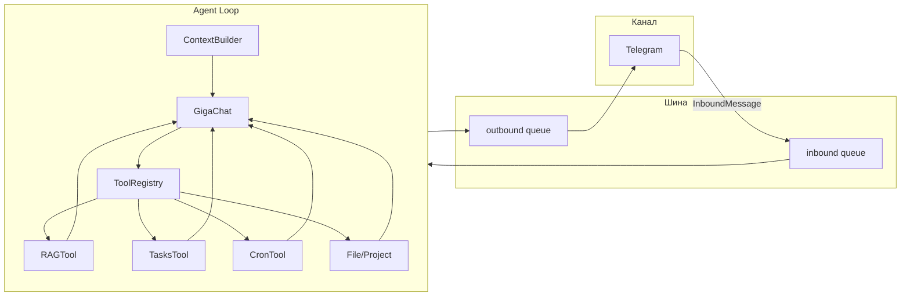

# Техническое задание: форк GigaBot под презентацию CSM в Сбере

Полный документ для реформирования/форка GigaBot под сценарий презентации: критичные функции, архитектура, зависимости, доработки.

---

## 1. Критичные функции (обязательные для демо)

### 1.1 RAG (база знаний)

- **Файл:** `gigabot/agent/tools/rag.py`
- **Конфиг:** `gigabot/config/schema.py` — `RAGConfig` (chroma_dir, embed_model, chunk_size, chunk_overlap, top_k)
- **Действия:**  
  - `create_project` — создание коллекции по имени проекта  
  - `delete_project` — удаление коллекции  
  - `list_projects` — список проектов RAG с количеством документов (фрагментов)  
  - `index_file` — индексация одного файла (путь к файлу)  
  - `index_folder` — индексация папки (folder_path или project + folder_name)  
  - `search` — семантический поиск по проекту (query, project, top_k)
- **Зависимости:** GigaChat provider (метод `get_embeddings`), ChromaDB (PersistentClient), workspace для разрешения путей проектов. Поддерживаемые форматы: .txt, .pdf, .docx, .doc, .xlsx, .xls.

### 1.2 Задачи (tasks)

- **Файл:** `gigabot/agent/tools/tasks.py`
- **Хранение:** `workspace.parent / "tasks" / "tasks.json"` (вне workspace)
- **Действия:** add, list, update, remove, complete
- **Поля задачи:** id, title, project, status (todo/in_progress/done), priority (low/medium/high), deadline (ISO), notes, created_at, updated_at
- **Зависимости:** workspace, опционально CronService для напоминаний по дедлайну (разовое напоминание в cron при указании deadline)

### 1.3 Напоминания (cron)

- **Файлы:** `gigabot/agent/tools/cron.py`, `gigabot/cron/service.py`, `gigabot/cron/types.py`
- **Хранение:** `~/.gigabot/cron/jobs.json` (или аналог из конфига)
- **Действия:** add (at / every_seconds / cron_expr), list, remove
- **Зависимости:** CronService (таймер, выполнение заданий), контекст канала/chat_id для доставки сообщений

### 1.4 Проекты и файлы

- **Файлы:** `gigabot/agent/tools/filesystem.py` — FileTool, ProjectTool
- **FileTool:** read, write, edit, list, move (в пределах allowed_dir при restrict_to_workspace)
- **ProjectTool:** create (шаблон подпапок: Договоры, Документация, Сметы, Фото, Переписка), list, add_folder, delete_folder, move_file, send_files
- **Зависимости:** workspace, при необходимости allowed_dir

### 1.5 Память и контекст

- **Память:** `gigabot/agent/memory.py` — MemoryStore  
  - MEMORY.md — долговременные факты  
  - HISTORY.md — журнал событий (append-only), grep-поиск
- **Контекст:** `gigabot/agent/context.py` — ContextBuilder  
  - Сборка системного промпта: identity, bootstrap-файлы (AGENTS.md, SOUL.md, USER.md, TOOLS.md, IDENTITY.md), память, навыки
- **Зависимости:** workspace (путь к memory/, projects/, skills/)

### 1.6 Навыки (skills)

- **Файл:** `gigabot/agent/skills.py` — SkillsLoader
- Загрузка из `workspace/skills` и встроенные `gigabot/skills`; каждый навык — директория с SKILL.md (опционально YAML frontmatter: description, always и т.д.)
- Используются в ContextBuilder для расширения возможностей агента (например, сценарий отчёта по задачам можно оформить как навык)

---

## 2. Архитектура

### 2.1 Поток сообщений

- **Канал** (например Telegram) получает сообщения пользователя и отправляет ответы. Адаптер канала публикует InboundMessage в шину и подписывается на OutboundMessage.
- **Шина (MessageBus):** два очереди — inbound, outbound (`gigabot/bus/queue.py`, `gigabot/bus/events.py`).
- **Agent Loop** (`gigabot/agent/loop.py`): забирает сообщения из inbound; собирает контекст (ContextBuilder: история сессии, память, навыки); вызывает LLM (GigaChat) с описаниями инструментов; выполняет tool_calls (RAG, tasks, cron, file, project и др.); отправляет ответы в outbound. RAG, tasks, cron — ключевые для демо CSM.

### 2.2 Зависимости модулей (кратко)

| Компонент | Зависимости |
|-----------|-------------|
| RAG | provider (get_embeddings), RAGConfig, workspace; ChromaDB накопитель (chroma_dir) |
| Tasks | workspace (путь к родителю для tasks/), CronService (опционально) |
| Cron | CronService (хранилище jobs, таймер, доставка в channel/chat_id) |
| Context | workspace, bootstrap-файлы, MemoryStore, SkillsLoader |
| Loop | MessageBus, LLMProvider, workspace, конфиги (RAG, Exec, SaluteSpeech), CronService, SessionManager; регистрирует все tools в ToolRegistry |

Конфигурация целиком: `gigabot/config/schema.py` (Config с вложенными GigaChatConfig, RAGConfig, TelegramConfig, AgentConfig и т.д.), загрузка — `gigabot/config/loader.py`.

---

## 3. Доработки под презентацию

### 3.1 Отчёт по задачам (критичность, сложность, дедлайн)

- **Требование:** По запросу пользователя агент формирует отчёт: какие задачи выполнить первыми, какие позже, по факторам критичность, сложность и дедлайн.
- **Вариант А (без изменения модели):** В текущей модели задачи есть `priority` (low/medium/high) и `deadline`. Отчёт строить на их основе: сортировка/группировка по приоритету и по срочности дедлайна; в тексте отчёта трактовать priority как «критичность», при необходимости «сложность» выводить из контекста (например, по длине title или по проекту) или не выводить. Реализация: навык (skill) или явная инструкция в системном промпте + вызов tasks(list).
- **Вариант Б (расширение модели):** Добавить в задачу поля, например `complexity` (low/medium/high) и/или `criticality` (low/medium/high). Хранить в tasks.json, обновить схему parameters в TasksTool (add, update), в list и в отчёте учитывать новые поля. Реализация: правки в `gigabot/agent/tools/tasks.py` и, при наличии, в навыке отчёта.
- **Рекомендация в ТЗ:** Начать с варианта А; при необходимости добавить вариант Б в форке.

### 3.2 Сводка аналитики (проекты, задачи, базы знаний)

- **Требование:** Одна команда или один «экран»: что в проектах (список проектов и при необходимости количество файлов/папок), какие задачи (краткая статистика: в работе, с дедлайном на неделю, по проектам), какие базы RAG (list_projects с объёмами).
- **Реализация:**  
  - **Вариант 1:** Новый tool, например `summary` или `analytics`, который внутри вызывает: обход workspace/projects (или project list), чтение tasks.json и knowledge(list_projects); собирает текстовую сводку и возвращает строкой. Регистрация в AgentLoop рядом с остальными tools.  
  - **Вариант 2:** CLI-команда, например `gigabot status --summary`, которая выводит ту же сводку в консоль (без вызова LLM). Для демо можно ограничиться показом через диалог (вариант 1).  
- **Файлы для изменений:** новый модуль `gigabot/agent/tools/summary.py` (или аналогичное имя), регистрация в `loop.py`; при варианте 2 — `gigabot/cli/commands.py`.

### 3.3 Демо-конфиг и пресет

- **Требование:** Чтобы демо стабильно проходило, иметь пример workspace: один проект с папкой «Документация» и 1–2 тестовыми файлами; 3–5 задач с разными приоритетами и дедлайнами; при необходимости уже созданная база RAG с проиндексированной папкой.
- **Реализация:**  
  - Скрипт или инструкция в GigaBotPresent: создание директорий, копирование тестовых PDF/DOCX, создание задач (вручную в JSON или через бота один раз и сохранение копии tasks.json).  
  - Опционально: конфиг-пресет «presentation» (например env или флаг), при котором отключаются редко нужные для демо tools (exec, spawn, kandinsky и т.д.) для уменьшения риска случайных вызовов и стабильности сценария. Реализация: в loop.py условная регистрация tools в зависимости от конфига.

---

## 4. Зависимости стека (внешние)

- **GigaChat:** SDK gigachat (чат + function calling, эмбеддинги EmbeddingsGigaR)
- **ChromaDB:** chromadb (локальное хранилище RAG)
- **Telegram:** python-telegram-bot
- **Cron:** croniter для cron-выражений; внутренний CronService на asyncio
- Опционально: SaluteSpeech (TTS/STT), Brave API (web search), Tesseract (OCR)

Развёртывание: при презентации можно описывать контур по аналогии с Cloud.ru (инфраструктура + GigaChat); сам бот может работать на любом хосте с Python и доступом к API GigaChat.

---

## 5. Итоговый чек-лист по форку

- [ ] Скопировать дерево исходного кода в `GigaBotPresent/gigabot/` (без .venv, __pycache__, rag_db и тяжёлых артефактов), скопировать pyproject.toml.
- [ ] Реализовать отчёт по задачам (вариант А или Б п. 3.1); при варианте Б — расширить tasks.py и схему задачи.
- [ ] Реализовать сводку аналитики (tool и/или CLI) по п. 3.2.
- [ ] Подготовить демо-пресет: проект, папка Документация, тестовые файлы, пример задач; при необходимости конфиг «presentation» с ограниченным набором tools.
- [ ] В README или docs внутри форка указать, что это форк под презентацию CSM, и дать ссылки на `GigaBotPresent/docs/` и `GigaBotPresent/tech-spec/`.

После выполнения ТЗ форк готов к настройке и проведению демо для CSM в Сбере согласно сценарию в документе 06.
